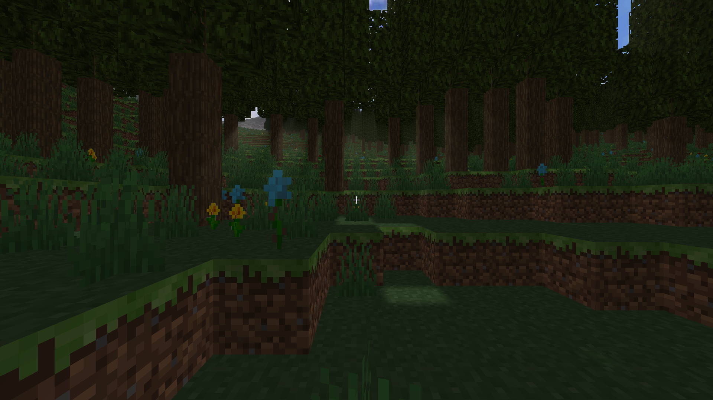
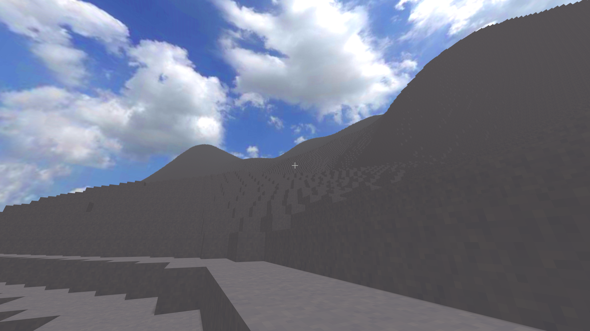
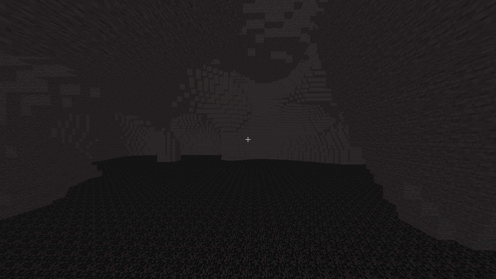
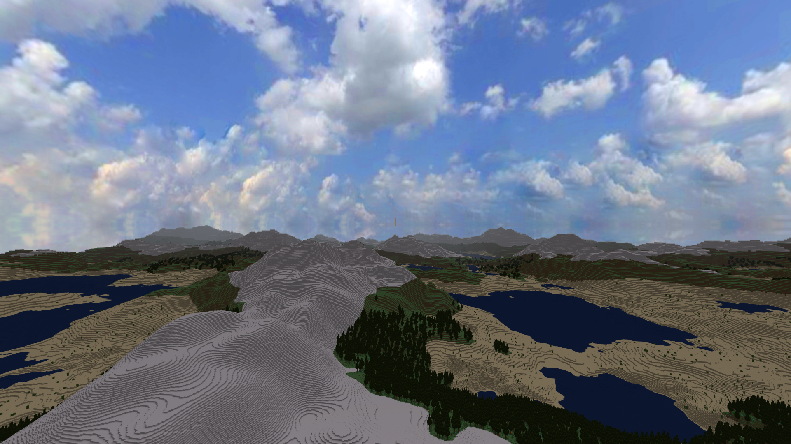
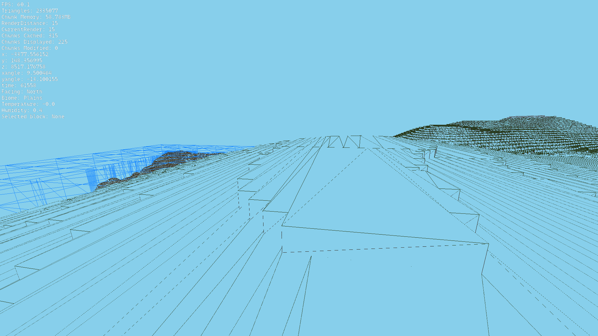
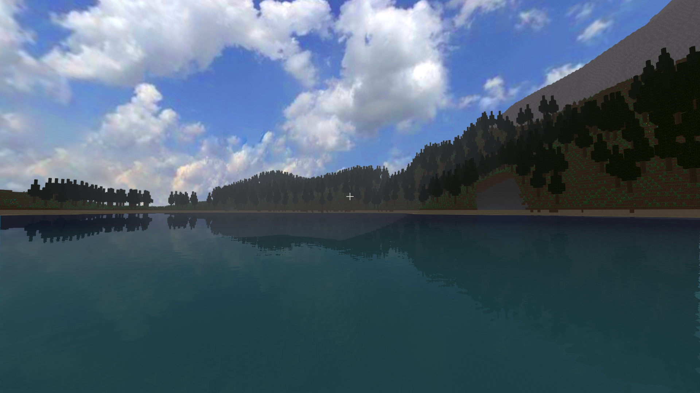
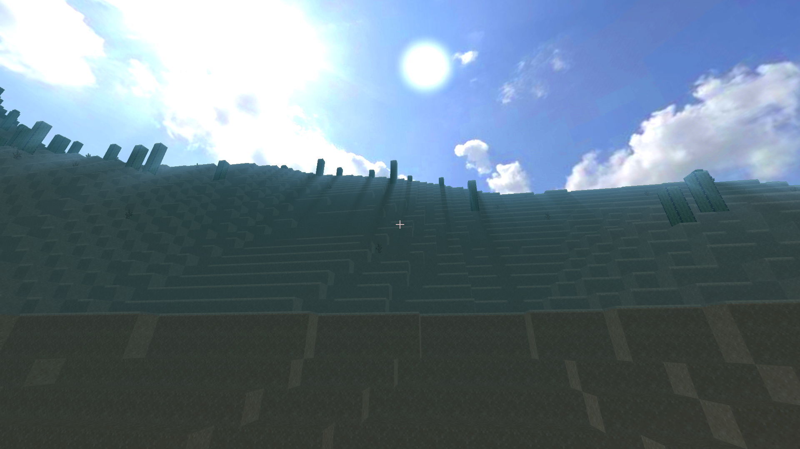

ft_vox — Voxel World Renderer 
 
ft_vox is a real‑time voxel world renderer focused on smooth performance and large‑scale terrain streaming. It generates terrain procedurally, builds chunk meshes on worker threads, and renders with modern OpenGL techniques to keep frame times steady while you explore. 
 
Highlights 
- Procedural terrain and biome shading with day/night cycle 
- Chunked world streaming with LRU caching and prioritized loading 
- Greedy meshing and solid/alpha split passes for efficiency 
- Water with planar reflections and animated normals 
- Skybox support, dynamic sun, shadows, fog and light “god rays” 
- Post‑process pipeline with MSAA resolve and UI overlay 
 
Dependencies 
- OpenGL + GLU 
- GLEW 
- GLFW 
- GLM (headers) 
 
On Ubuntu/WSL 
- sudo apt update 
- sudo apt install build-essential libgl1-mesa-dev libglu1-mesa-dev libglew-dev libglfw3-dev libglm-dev 
 
Build 
- make          # optimized build → ft_vox 
- make debug    # debug build → ft_voxDebug 
 
Run 
- ./ft_vox [seed] 
  - Optional numeric seed customizes world generation (default: 42). See srcs/main.cpp:12. 
 
Basic Controls 
- Move: W / A / S / D 
- Look: Mouse (toggle capture with M or ;) 
- Jump: Space (with gravity on) 
- Fly up/down: Space / Left Shift (with gravity off) 
- Sprint: Left Ctrl (toggle when gravity on; hold for fast fly when off) 
- Break / Place / Pick block: Mouse Left / Right / Middle 
- Zoom FOV: Mouse wheel 
- Fullscreen: F11 
 
Toggles & Tools 
- H: Help panel (keybinds) 
- F1: UI overlay (crosshair, HUD) 
- F3: Debug overlay 
- F4: Triangle mesh (wireframe) view 
- F5: Invert camera 
- L: Toggle dynamic lighting (forces daytime when off) 
- G: Toggle gravity 
- C: Toggle world generation/streaming 
- P: Pause day/night time update 
- Numpad + / −: Accelerate or rewind time 
- Esc: Quit 
 
Notes 
- The project links against OpenGL, GLU, GLEW and GLFW (see Makefile:4). GLM is header‑only. 
- A static GLEW is included in lib64 for convenience; system packages also work. 
- First launch shows a short loading splash while initial chunks stream in. 
## Screenshots

A quick look at terrain generation, rendering passes, and water/atmosphere effects.

### World generation and shaders

	
	

	
	

### Meshing & rendering

	

### Water & underwater

	
	

